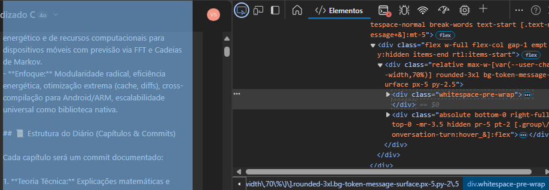

# **Extraction**  

The first step I execute is the **initial mapping**, where I use **developer inspection tools** to run a script that allows for **data extraction and cleaning**, making it easier for the LLM to analyze by **disabling unnecessary tensors**.

Each passing message acts as a **"weight bit"**, accumulating influence over the **incremental training of the federated model**. This follows an **exponential effect**—the more messages processed, the more the system absorbs the weight, similar to a **payload gaining mass**, depending on user interaction.  

This is a **high-level computational perspective**, treating **human interactions the same way a neural network handles gradients** during training. Essentially, I am applying **a probabilistic inference model** to deconstruct and understand my own cognition through AI.  

---

## **Script**  

1. In this case, the **initial script was AI-generated**, where I extract the class that identifies the tags containing the produced prompts.  

<figure><figcaption></figcaption></figure>  

2. I execute the script to extract the **blocks** within the `div.whitespace-pre-wrap` tag.  

  
```javascript
(() => {
  const a = [...document.querySelectorAll("div.whitespace-pre-wrap")] // Selects all message blocks
    .map(msg => msg.innerText.trim() // Trims whitespace for data compression
    .replace(/\s+/g, " ")) // Normalizes line breaks
    .filter(msg => msg.length); // Filters out empty messages

  // Iterates and logs the extracted messages, including the chat title
  a.forEach((msg, idx) => console.log(`Chat: ${document.title} | Message ${idx + 1}: ${msg}`));
})();
```
  

3. After running the script in the console, I generate a **raw dataset** for my own mapping.  

With this, I produce **a personalized dataset** that can be used to train a new model, effectively configuring it with **my own linguistic and stylistic patterns**.

  
I always try to repeat this snippet manually to reinforce and internalize the logic.  
  
