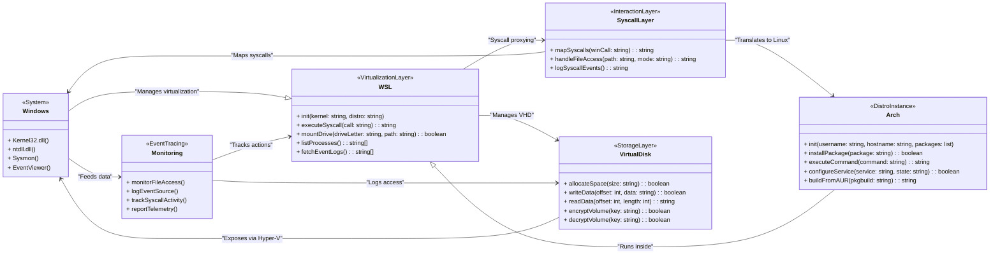

# How Does WSL2 Work? (Hardware, Kernel & Shell)

WSL2 **is essentially a lightweight virtual machine running a full Linux kernel on top of Windows**. Think of it like **Venom and Eddie**—where **Eddie (a shit of piece) is the host** and **Venom (fucking cosmic entity) is the parasite that actually runs the show**.

Through this layer, it can:

* **Perform syscalls**,
* **Read and write files**,
* **Compile packages**,
* **Manage processes**,
* **Access system resources**—all while Windows remains the primary OS.

Since WSL2 operates within a **virtual hard disk (VHD)**, it automatically handles partitioning. No need to manually fiddle with disk tables.

Here's a **Mermaid diagram** to visualize the architecture:

